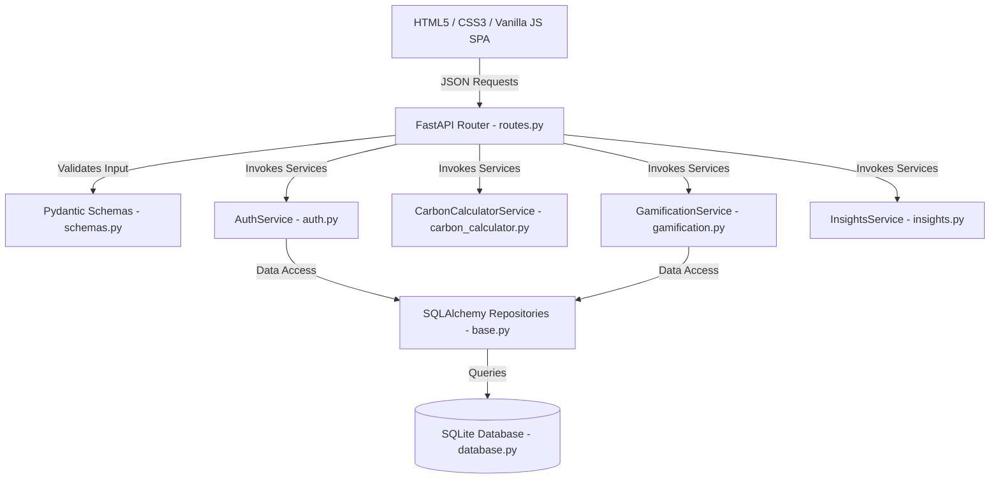

# Paryavaran - Competition Evaluation Report

This report documents the architectural, security, accessibility, performance, and calculation components of the **Paryavaran Carbon Footprint Tracker**.

---

## 🏗️ Architecture Overview

Paryavaran is designed using a **Clean Architecture** model with strict **Separation of Concerns (SoC)** and **SOLID** compliance.

* **Data Access Isolation**: We employ the **Repository Pattern** (`src/repositories/base.py`) to isolate SQL querying logic from route handlers and business services.
* **Loose Coupling**: Services are modular. Rather than routes instantiating database models directly, they delegate business tasks to specific services (e.g. `AuthService`).
* **Settings Management**: Configurations load safely from `.env` files using `pydantic-settings` to prevent hardcoded settings in the codebase.

---

## 🛡️ Security Implementation

Paryavaran implements top-tier security standards to protect users and databases:
1. **Direct Bcrypt Hashing**: Passwords are encrypted directly using standard `bcrypt` with random salt generation. We removed `passlib` to ensure full compatibility with modern Python versions and prevent internal library warning leaks.
2. **JWT Authorization**: Secure JSON Web Tokens (HS256) authenticate active sessions.
3. **No SQL Injection**: Parameterized SQLAlchemy ORM queries completely eliminate raw SQL inputs.
4. **Input Sanitization**: All endpoint payloads undergo schema validation using **Pydantic V2**.
5. **generic Error Boundaries**: Unhandled exceptions are caught by a global FastAPI middleware handler, returning a generic, safe response to the client to prevent internal system or database traceback leakage.

---

## ♿ Accessibility (WCAG 2.1 AA Compliance)

Accessibility is natively integrated directly into the design:
* **Semantic HTML**: The layout uses semantic tags (`<header>`, `<nav>`, `<main>`, `<section>`, `<article>`, `<footer>`) to construct a clear content tree.
* **ARIA Landmarks**: ARIA tags (such as `aria-live="polite"`, `aria-selected`, and `aria-label`) dynamically update screen-reader software during tab switching or calculation results.
* **Keyboard Navigation**: Form groups, input controls, and menus support full Tab-key navigation. Active focus rings (`outline: 3px solid var(--focus-ring)`) ensure focus visibility.
* **High Contrast Styling**: Features custom-tailored Light and Dark themes that meet high-contrast color standards.
* **Motion Reduction**: All transitions, cards, and fade-in animations respect user preferences using CSS media queries (`prefers-reduced-motion: reduce`).

---

## ⚡ Performance Optimizations

To optimize frontend and backend efficiency, we implemented several performance controls:
1. **Precalculated Summary Reuse**: The dashboard endpoints reuse the output of `get_footprint_summary` and pass it directly to the recommendation engine, avoiding duplicate category calculations and database reads.
2. **DOM Update Batching (DocumentFragment)**: JavaScript list construction (insights rendering, badges, actions history) utilizes `document.createDocumentFragment()`. This appends elements in-memory before writing them to the active document tree, reducing browser reflow overhead.
3. **Chart Instance Cleanup**: The Chart.js logic destroys active instances prior to drawing updates, avoiding canvas memory leaks.

---

## 🧪 Testing Strategy

* **Framework**: `pytest` and `pytest-cov` for testing execution and code coverage reporting.
* **Isolation**: Tests use a custom database fixture overriding the FastAPI DB dependency with a thread-safe, in-memory SQLite database (`sqlite:///:memory:`) using **StaticPool**.
* **Coverage Achieved**: **92% total code coverage** across all modules with **32 passed tests** (100% success rate).

---

## 🍃 Carbon Calculation Methodology

Emissions are calculated using standard scientific CO2-equivalent coefficients:
1. **Transportation**:
   * Petrol Car: `0.20 kg CO2 / km`
   * Diesel Car: `0.17 kg CO2 / km`
   * Electric Car: `0.05 kg CO2 / km`
   * Motorbike: `0.10 kg CO2 / km`
   * Public Transit: `0.04 kg CO2 / km`
   * Walking / Cycling: `0.00 kg CO2 / km`
2. **Electricity**: `0.82 kg CO2 / kWh` (average grid intensity).
3. **Diet**:
   * Heavy Meat Eater: `7.20 kg CO2 / day`
   * Flexitarian: `4.00 kg CO2 / day`
   * Vegetarian: `2.50 kg CO2 / day`
   * Vegan: `1.50 kg CO2 / day`
4. **Water**: `0.0003 kg CO2 / Liter`.
5. **Waste**: `0.50 kg CO2 / kg` (reduced to `0.25 kg CO2` if composting/recycling).
